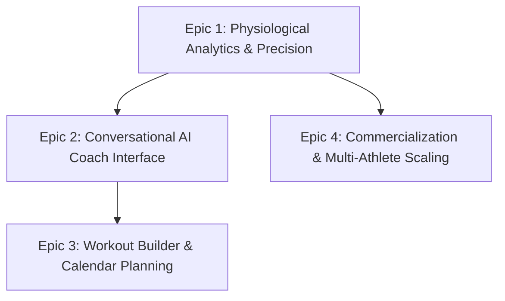

# AI Coach — Product Backlog

**Last Updated:** 6 October 2026  
**Status:** Active Product Roadmap  
**Document Owner:** Gemini (Requirements & Architecture Lead) in alignment with Magne

---

## 1. Product Vision & Architecture Principles

AI Coach is an intelligent endurance coaching platform that bridges deterministic sports science with conversational AI. It ingests workout files and daily wellness from Intervals.icu, computes rigorous physiological metrics (Critical Power, $W'$ battery, PMC, Durability), and gives athletes actionable coaching without exposing LLMs to raw, token-heavy time-series data.

### Foundational Principles:
1. **Deterministic Math Engine:** All physiological modeling ($CP$, $W'$, $CTL$, $ATL$, $TSB$, $NP$, $TSS$, $kJ$) is computed strictly via deterministic backend code and verified algorithms, never hallucinated by an LLM.
2. **Context-Grounded Coaching:** The LLM consumes pre-aggregated, lightweight JSON summaries (~2 KB per workout vs 15 MB raw FIT files) using [`AI_COACH_SYSTEM_PROMPT.md`](docs/AI_COACH_SYSTEM_PROMPT.md).
3. **Multi-Tenant & Commercial-Ready:** Complete athlete data isolation under Firestore `users/{userId}/*`, automated background sync, and integrated recurring subscription billing (Vipps MobilePay & Stripe).
4. **Lightweight Frontend:** Sub-50 KB gzipped vanilla JS/CSS web dashboard prioritizing high performance, system fonts, and clean dark ergonomics.

---

## 2. Epics & Feature Backlog

---

### Epic 1: Physiological Analytics & Precision (GoldenCheetah & Vekta Parity)
*Objective: Deliver elite-tier physiological analysis and eliminate static estimates.*

| ID | Story / Feature | Priority | Status | Description & Acceptance Criteria |
| :--- | :--- | :--- | :--- | :--- |
| **PHY-01** | **Critical Power & $W'$ Curve Field Verification** | **P0** | **Ready for Test** | Verify that CP & $W'$ pickup reliably from Intervals.icu profile / workout MMP history rather than falling back to default 250W. Support 2-parameter Monod/Scherrer hyperbolic regression over 2m–15m power bests. |
| **PHY-02** | **Durability Profiling (Fatigue Resistance)** | **P1** | **Backlog** | Calculate power duration degradation after 1,000 kJ, 1,500 kJ, and 2,500 kJ of accumulated mechanical work (Maunder et al. 2021, Mateo-March et al. 2024). Display fresh vs. fatigued curves. |
| **PHY-03** | **Dynamic $W'$ Balance & Match Burning** | **P1** | **Backlog** | Render Skiba (2015) differential anaerobic battery expenditure and reconstitution in workout detail views. Flag match-burning surges above CP. |
| **PHY-04** | **Aerobic Decoupling & Cardiac Drift** | **P2** | **Backlog** | Calculate internal vs. external load decoupling ($Pw:HR$ for cycling, $Pace:HR$ for running) across steady-state Z2 efforts to detect acute fatigue and cardiovascular drift. |
| **PHY-05** | **Running Critical Speed ($CS$) & $D'$ Modeling** | **P2** | **Backlog** | Extend velocity-duration modeling to running sessions with grade-adjusted pace (GAP) and distance-based anaerobic reserve ($D'$ in meters). |

---

### Epic 2: Conversational AI Coach Interface (The Chat Experience)
*Objective: Give athletes an omnipresent, intelligent coach inside the dashboard.*

| ID | Story / Feature | Priority | Status | Description & Acceptance Criteria |
| :--- | :--- | :--- | :--- | :--- |
| **CHAT-01** | **Dashboard In-App Chat Drawer** | **P0** | **Backlog** | Embed a native, responsive chat interface inside `https://aiworkoutbuilder.app/dashboard/` connected to `ai-coach-chat` backend, allowing direct dialogue with the coach. |
| **CHAT-02** | **Daily Morning Briefing & Readiness Check** | **P1** | **Backlog** | Coach proactively synthesizes overnight sleep/HRV, yesterday's training stress, and current TSB/form to deliver a 3-sentence daily readiness recommendation. |
| **CHAT-03** | **Post-Workout Debrief & Analysis** | **P1** | **Backlog** | Athlete can select a completed workout and ask "How did I execute this session?", receiving feedback grounded in TiZ, pacing, and $W'$ depletion. |
| **CHAT-04** | **Conversational Long-Term Goal Setting** | **P2** | **Backlog** | Coach interviews the athlete on upcoming target events (e.g. Birkebeineren, marathon, gran fondo) and establishes a multi-week macrocycle periodization target. |

---

### Epic 3: Interactive Workout Builder & Calendar Planning
*Objective: Turn coaching advice into executable training sessions on athlete devices.*

| ID | Story / Feature | Priority | Status | Description & Acceptance Criteria |
| :--- | :--- | :--- | :--- | :--- |
| **PLAN-01** | **Interactive Visual Workout Builder** | **P1** | **Backlog** | Visual UI in dashboard to construct stepped interval workouts (warm-up, interval sets, recovery, cool-down) with target zones (% CP/FTP or % HR). |
| **PLAN-02** | **Push Planned Workouts to Intervals.icu Calendar** | **P1** | **Backlog** | Directly push AI-recommended or athlete-built workouts onto the Intervals.icu calendar via API, syncing automatically to Garmin/Wahoo/Zwift devices. |
| **PLAN-03** | **Direct Device File Downloads (.ZWO & .FIT)** | **P2** | **Backlog** | Allow 1-click download of `.zwo` (Zwift) and `.fit` (Garmin structured workout) files directly from the dashboard calendar. |
| **PLAN-04** | **Adaptive Calendar Rescheduling** | **P2** | **Backlog** | When an athlete misses a key workout or reports high life stress / poor recovery, coach automatically re-balances remaining weekly sessions. |

---

### Epic 4: Commercialization & Multi-Athlete Scaling
*Objective: Scale the platform from personal tool to commercial product.*

| ID | Story / Feature | Priority | Status | Description & Acceptance Criteria |
| :--- | :--- | :--- | :--- | :--- |
| **BIZ-01** | **Production Vipps Recurring Activation** | **P0** | **Backlog** | Transition from sandbox test credentials to production Vipps MobilePay recurring agreement keys and live webhook endpoints. |
| **BIZ-02** | **Athlete Profile & Zone Settings UI** | **P1** | **Backlog** | UI view allowing athletes to view/override baseline parameters (FTP, CP, Max HR, Resting HR, Weight, Coggan Power Zones). |
| **BIZ-03** | **Multi-Athlete Coach Portal (B2B)** | **P3** | **Backlog** | Allow human endurance coaches to monitor multiple athletes, view group PMC trends, and supervise AI recommendations. |

---

## 3. Completed & Production-Verified Milestones

| Milestone / Feature | Shipped Date | Release Commit | Key Outcomes |
| :--- | :--- | :--- | :--- |
| **Roadmap A: PMC & MMP Curve** | 2026-10-02 | `03b4458` | 84-day rolling EWMA CTL/ATL/TSB, 42-day warm-up lookback, interactive SVG chart, dynamic CP fallback from MMP. |
| **Roadmap B: Multi-Tenant Architecture** | 2026-10-02 | `de58437` | User-scoped Firestore isolation (`users/{uid}/*`), registration endpoints, security rules, owner bypass. |
| **Roadmap B: Billing & Terms of Sale** | 2026-10-02 | `f26e665` | Vipps Recurring agreement v3 flow (199 NOK/mo), Norwegian terms of sale, Stripe fallback. |
| **Roadmap B: Intervals Sync & Navigation** | 2026-10-05 | `e842c9f` | Intervals.icu credential modal, tenant sync runner, calendar & sport filter event routing fixes. |
